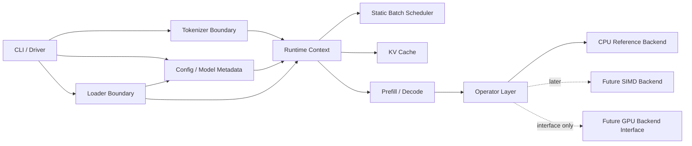
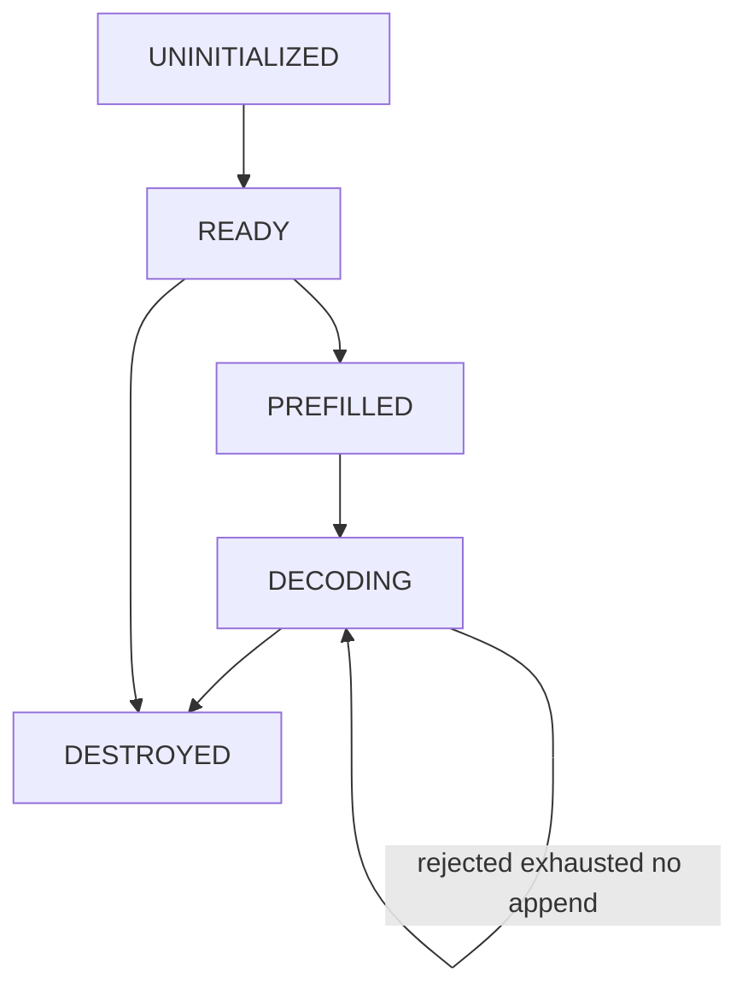
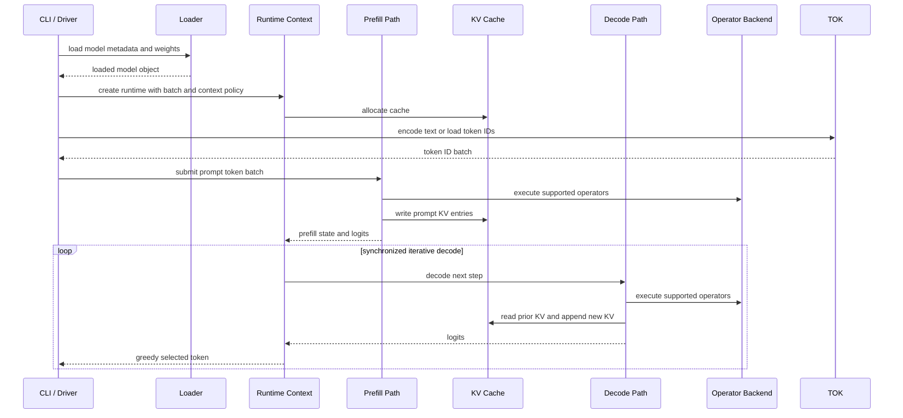

# LIS Architecture

This document describes the high-level architecture for LIS. It is a design document, not implementation authorization. Keep it synchronized with [`function_design.md`](function_design.md).

## System Goal

LIS starts as a CPU-first reference implementation for local, offline causal LLM inference. The first runnable target is intentionally narrow: single process, single node, CPU-only execution, batch prefill, synchronized iterative decode, and greedy decoding.

The architecture should be able to grow toward models in an up-to-10B-parameter functional support envelope, but early validation can and should use smaller models. This envelope is a design constraint, not a performance guarantee.

## Module Boundaries

### CLI / Driver

The CLI is a local offline entrypoint. It owns user-facing argument parsing, simple diagnostics, and handoff to loader, tokenizer boundary, and runtime. It must not own model math or file format parsing.

The validation driver supports safetensors model paths, Llama-style config
paths, direct token-ID input, configured context length, static batch size, and
greedy generation limit. It uses a `lis.validation_logits` tensor to exercise
loader, runtime, backend operator dispatch, prefill, decode, and output without
claiming full transformer execution.

The CLI keeps that validation path for direct safetensors fixtures and supports
a HuggingFace-local Llama execution path. When `--model` resolves to a
supported HuggingFace directory, the CLI runs the CPU reference Llama forward
path over mapped tensors instead of requiring `lis.validation_logits`.

The CLI includes only a canonical prompt-construction path for the currently
supported Llama Instruct workflow and a minimal opt-in generation diagnostic
surface. `--hf-tokenizer PATH --prompt TEXT` treats `TEXT` as the single user
message and wraps it with the canonical Llama Instruct prompt before encoding.
Direct token-ID input and validation fixtures remain outside prompt templating.

The `--diagnostics` surface includes top-k candidate entries per generation
step. It does not add CLI arguments, change generation behavior, or alter
default output.

The CLI supports `--trace-json PATH` for bounded per-step decode-trace artifact emission. It does not change default generation output, decode policy, or any existing CLI surface.

### Tokenizer Boundary

The tokenizer boundary defines how token IDs enter and leave the runtime. Initial runtime work should be testable with token IDs directly, so tokenizer implementation details do not block backend and runtime development.

The direct-token path accepts unsigned token IDs from a text file
(`--tokens` path).

BPE tokenization and detokenization sit behind the same boundary
(`--vocab` + `--prompt` path). The tokenizer loads a vocabulary and merge table
from the LIS_VOCAB_V1 file format, encodes text to token IDs via byte-pair
encoding, and decodes generated token IDs back to text via vocabulary lookup.

**LIS_VOCAB_V1 is an internal canonical format.** It is not a parser for SentencePiece `.model` or tiktoken files.

LIS supports direct import of HuggingFace `tokenizer.json` files (BPE type)
into the existing `lis_tokenizer` struct via `lis_hf_tokenizer_load()`,
eliminating the external conversion step for the most common real-world
tokenizer artifact. The CLI exposes this via
`--hf-tokenizer PATH --prompt TEXT`. LIS_VOCAB_V1 remains available as an
alternative loading path.

### Config / Model Metadata

The config layer owns model-family metadata, Llama style decoder-only settings, dtype expectations, plain RoPE parameters, vocabulary size, layer dimensions, and trained maximum context. It must distinguish functional support envelope from validation/test target envelope. Configs requesting `rope_scaling` or non-default `rope_type` variants are rejected until those RoPE variants are implemented.

### Loader Boundary

The loader layer owns file format parsing and weight mapping. Runtime code consumes loaded metadata and tensors; it must not depend on safetensors internals. Safetensors is the first planned load format. Limited PyTorch-exported compatibility is a later scoped compatibility target, not a general PyTorch runtime dependency.

### Runtime Context

The runtime context owns loaded model state, configured context length, batch constraints, backend selection, execution buffers, and lifecycle. It coordinates prefill, decode, scheduler, and KV cache.

The runtime boundary is a host-side context with copied model metadata, a
borrowed backend descriptor, static batch positions, and an owned KV cache.
Runtime initialization validates model metadata, backend compatibility, batch
size, and context policy before allocating mutable runtime state.

The CPU reference Llama path uses `lis_runtime_llama_prefill` and
`lis_runtime_llama_decode`. The implementation performs f32 compute over mapped
HuggingFace tensors, reads f32/f16/bf16 weights, writes KV cache entries in the
configured dtype, and is scoped to batch 1.

The runtime context owns a pthreads thread pool. Compute-heavy loops in the
Llama forward path (`lis_matvec`, `lis_attention`, `lis_apply_rope`, RMSNorm
scale, SwiGLU elementwise) are parallelized across pool workers using fork-join
dispatch. Thread count is configurable at runtime initialization via
`--threads N`. `--threads 1` preserves the single-threaded baseline with zero
dispatch overhead.

LIS includes a minimal repetition-penalty generation-quality pass only. It
preserves the existing runtime architecture, Llama forward APIs, batch shape,
KV cache layout, and greedy decode boundary.

Prompt construction remains a CLI/tokenizer-side responsibility, and generation
diagnostics observe existing greedy selection behavior without adding decode
modes.

Extended top-k candidate diagnostics remain observational on the CLI/diagnostic
side and do not change runtime ownership.

### Scheduler / Batching

Initial batching is static batching. A batch is formed before execution and decoded in synchronized iterative steps. Continuous batching, request admission, and production scheduling are later features.

Batching remains static: batch size is fixed at runtime initialization, prefill
receives exactly one length per batch entry, and decode advances all entries
synchronously. The static scheduler does not interpret EOS token IDs or
per-sequence stop conditions; later tokenizer/decode integration can add that
behavior.

Batch-size expansion, continuous batching, request admission, and production
scheduling remain future work outside the repetition-penalty scope.

### KV Cache

The KV cache owns attention key/value storage across prefill and decode. Its shape and allocation depend on model metadata, batch size, configured context length, attention layout, and dtype.

The KV cache allocates separate key and value buffers sized by layer count,
static batch size, configured context length, KV head count, head dimension,
and dtype. It exposes validated offset and pointer helpers but does not
implement attention computation.

### Prefill / Decode

Prefill and decode are separate from the beginning:

- Prefill processes prompt tokens in batch and initializes KV cache state.
- Decode consumes the cache and advances one or more synchronized iterative steps.
- Greedy next-token selection is the initial decoding mode.

Runtime state represents this separation as explicit prefill/decode
transitions. Prefill validates and records initial sequence positions. Decode
validates that prefill already happened and advances positions by one
synchronized step while enforcing the configured context limit. The greedy
helper is a minimal logits argmax utility, not an end-to-end token generation
loop.

The batch-1 Llama token forward pass behind the prefill/decode boundary covers:
token embedding lookup, per-layer RMSNorm, Q/K/V projection, plain RoPE from
`rope_theta`, grouped-query causal attention over KV cache, output projection,
SwiGLU MLP, final norm, and lm_head logits.

The decode loop stops on a token listed in `eos_token_id` from the model config. In tokenizer-backed text output, the CLI stops before printing EOS/end-of-turn control tokens and excludes known structural Llama chat controls such as header and begin-of-text markers from greedy selection.

The per-token forward pass can run across CPU cores using a thread pool. The
compute-heavy operations (`lis_matvec`, `lis_attention`, `lis_apply_rope`,
RMSNorm scale, SwiGLU) partition their iteration space across worker threads.
The forward pass structure is unchanged; parallelism is applied within each
operation.

The existing user-facing generation path includes only a minimal repetition
penalty. Tokens already emitted during the current generation receive a fixed
`1.2` penalty during greedy selection. Positive logits for repeated tokens are
divided by `1.2`; negative logits are multiplied by `1.2`; zero logits are
unchanged. This does not add top-k, top-p, temperature, beam search,
speculative decoding, or a broad decode-policy subsystem.

The decode policy remains greedy. `--diagnostics` output is written to stderr
and is limited to reporting selected token ID, selected token text when
available, stop reason, and whether structural-token suppression or the
repetition penalty affected the selection step.

The diagnostic surface exposes the top-k highest-scoring candidates at each
greedy step, including candidate token IDs, token texts, raw logit scores, and
adjusted scores. It does not change decode policy, generation behavior, or
default stdout output.

### Operator Layer

The operator layer is the boundary between runtime/model logic and backend execution. It should make tensor shape, dtype, ownership, and failure behavior explicit.

LIS implements this as a small host-memory operator dispatch boundary. The
initial supported operators are f32 elementwise add and f32 2D matmul. The
generic operator layer validates tensor shape, dtype, output storage, and buffer
size before dispatching to a backend.

### CPU Reference Backend

The CPU reference backend is the first execution backend and correctness baseline. It favors readability, deterministic behavior, and testability over aggressive optimization.

The CPU reference backend implements the initial supported operators with
straightforward scalar loops. It is not an optimized path and must remain
available for later backend comparisons.

### Future SIMD and GPU Backends

SIMD and GPU are extension paths. The architecture must expose hooks for future optimized matmul, elementwise operations, and backend-specific buffers. GPU support is interface/design preparation only until explicitly authorized.

The backend interface reserves backend kinds and a memory-domain field for
future SIMD/GPU work. Backend-owned buffers are represented as an interface
concept only; no GPU buffers or kernels are implemented.

Design decisions for SIMD, optimized matmul, GPU backend, scheduler enhancement, and custom operator insertion:

- SIMD backends detect CPU features at runtime and return `LIS_STATUS_UNSUPPORTED` for operations they cannot handle; fallback to the CPU reference is the caller's responsibility.
- GPU backends use `LIS_BACKEND_MEMORY_BACKEND_OWNED` with opaque handles in the existing `void *data` field; host-GPU transfers happen at explicit boundaries.
- Custom operators follow a compile-time-fixed set with centralized validation; no dynamic registration.
- All optimized backends must pass correctness comparison against the CPU reference.

## KV Cache Subsystem

The current KV cache lifecycle and runtime contract include additive memory
transparency through `report.kv_cache`, the Markdown companion,
diagnostics-only summary stderr, compatibility tests, and regression coverage.
This section documents current behavior and the contract future KV work must
preserve.

- KV cache is run-local to one `lis_runtime_context`.
- KV cache is not reused across CLI runs.
- KV entries are indexed by logical token position within `[0, context_length)`.
- Full KV address shape is `(layer, batch, position, head, dim)`.
- KV memory is allocated eagerly at `lis_runtime_init` from
  `metadata.config.context.configured_max_tokens`.
- KV cache is owned by `lis_runtime_context` and freed in
  `lis_runtime_destroy`.
- Prefill writes one KV entry per prompt token at the prompt position, for every
  layer.
- A successful decode step writes one KV entry per layer at the next accepted
  position.
- If a decode step is rejected because `position >= max_tokens`, no KV entry is
  written, no token is emitted, and logical `used_tokens` does not advance.
- `used_tokens` means logical populated token positions, not number of
  per-layer writes.
- Reset, if kept later, is internal-only/test-lifecycle-only; current LIS has
  no CLI reset or request-reuse semantics.
- Current policy is eviction-free and monotonic-growth:
  - `eviction_free=true`
  - `monotonic_growth=true`
  - `paging=false`
  - `offload=false`
  - `sliding_window=false`
  - `prefix_reuse=false`

### Minimal Internal KV Operation Boundary Strategy

The current internal KV boundary strategy confirms boundary properties and a
candidate direction only. It does not ratify an exact C ops/vtable API, add C
symbols, or choose final helper signatures. Current LIS has no public/plugin KV
API, second backend, runtime selector, per-position commit boundary, or full
write-path migration.

Required boundary properties:

- Internal-only.
- No public ABI.
- No plugin loading.
- No second in-tree backend.
- No runtime selector.
- No `--kv-backend` flag.
- No attention math changes.
- No generated-token behavior changes.
- No `lis_kv_cache_layout` shape changes.
- No hot-path allocation, logging, or atomics.
- Default behavior preserves current direct-buffer semantics.

Current source findings:

- KV memory uses the existing flat `keys` / `values` buffers and the
  precomputed `lis_kv_cache_layout`.
- Current read/write access uses `lis_kv_cache_element_offset`,
  `lis_kv_cache_key_ptr`, and `lis_kv_cache_value_ptr`.
- Qwen3 and Llama runtime paths currently perform KV writes from their model
  runtime files using local `lis_store_kv` helpers, pointer lookups, and scalar
  writes into the configured KV dtype.
- Attention reads use the same pointer helpers and pass the current KV dtype
  into attention dot/product helpers.
- Any future boundary must fit this existing pointer/offset shape. It must not
  force row-copy append semantics or a generalized backend framework where the
  current source structure does not require one.

Candidate shape decision:

- Candidate A: query/policy/accounting-only seam.
  - Recommended first internal boundary direction.
  - Low risk.
  - Does not require write-path migration.
  - Supports memory transparency from the current layout and runtime state.
- Candidate B: per-position commit helper.
  - Deferred and conditional.
  - Use only if accounting clarity requires it.
  - Must advance logical `used_tokens` at most once per accepted position.
  - Must not be called per layer.
- Candidate C: write-view/helper migration.
  - Deferred and optional.
  - Attempt only after Candidate A is stable and tests exist.
  - If attempted, migrate Qwen3 first, then Llama.
  - Not required for current public support.

Rejected for the current public support boundary:

- Fixed public plugin API.
- Runtime-loadable KV backend.
- Second backend stub.
- Exact ops/vtable API ratified in documentation.
- Per-layer append that increments `used_tokens`.
- Row-copy append API if it does not match current source structure.
- Generalized future-proof backend framework.

### KV Cache Precision and Storage Policy

The KV precision/storage policy is documented without changing runtime
behavior. The resolved KV storage dtype is the current
`lis_kv_cache_layout.dtype`, which is computed during `lis_kv_cache_init` from
`config->weight_dtype`.

Qwen3 and Llama currently produce K/V values in FP32 scratch buffers, obtain KV
element pointers through `lis_kv_cache_key_ptr` and
`lis_kv_cache_value_ptr`, and store each element with the existing
`lis_scalar_write` helper using `runtime->kv_cache.layout.dtype`. Attention
reads pass the same resolved KV dtype to `lis_attn_qk` and `lis_attn_pv`; KV
storage dtype is not the accumulation dtype, and current LIS does not change attention
math, scalar conversion math, or FP32 accumulation semantics.

`precision_path` remains the human-readable run precision summary:
`f32_accum;weights=<dtype>;kv=<dtype>`. The
`report.kv_cache.storage_dtype` field must agree with the `kv=<dtype>`
component of `precision_path`. This field does not change the artifact schema
or kind and does not add new dtype support. See
[`precision_policy.md`](precision_policy.md) for the full policy and
unsupported precision cases.

## CPU-First Design

The CPU reference path should remain complete and available even after optimized backends are added. This gives later SIMD, optimized matmul, or GPU implementations a correctness baseline.

CPU-first does not mean CPU-only architecture forever. It means:

- generic runtime logic calls backend interfaces
- CPU backend implements the first supported operators
- optimized backends are introduced behind dispatch boundaries
- backend-specific assumptions do not leak into loader, CLI, or config code

## Prefill and Decode Flow

## Static Batching Rationale

Static batching is the initial design because it is easier to reason about and test than continuous batching. It makes these properties explicit:

- batch size is known for a run or runtime context
- KV cache allocation can be sized up front
- synchronized decode steps avoid request scheduling complexity
- correctness can be validated before introducing admission control or dynamic request mixing

This does not claim static batching is optimal for throughput. It is a narrow first target.

## Model Loading and Format Strategy

Initial loading strategy:

1. Define a loader abstraction independent of file format internals.
2. Plan and implement safetensors loading first.
3. Scope limited PyTorch-exported weight compatibility after safetensors boundaries are clear.
4. Defer save support until a specific save semantic is documented and authorized.

The loader must validate tensor names, shapes, dtypes, byte sizes, and file bounds. It should report unsupported cases clearly rather than silently accepting ambiguous model layouts.

## Context Window Policy

Context window configurability is an architecture decision. Current validation hardens the
context and positional semantics contracts as fail-fast, auditable boundaries.

### Contract Table

| #  | Subject | Ruling | Status Code |
|----|---------|--------|-------------|
| C1 | `configured_max_tokens > trained_max_tokens` | Rejected / fail-fast | `LIS_STATUS_LIMIT_EXCEEDED` |
| C2 | `configured_max_tokens == trained_max_tokens` | Supported | — |
| C3 | `configured_max_tokens == 0` or `trained_max_tokens == 0` | Rejected / fail-fast | `LIS_STATUS_INVALID_ARGUMENT` |
| C4 | `config_mode` value other than `LIS_CONTEXT_CONFIG_RUNTIME` | Rejected / fail-fast | `LIS_STATUS_UNSUPPORTED` |
| C5 | `over_trained_policy` value other than `LIS_CONTEXT_OVER_TRAINED_REJECT` | Rejected / fail-fast | `LIS_STATUS_UNSUPPORTED` |
| C6 | `rope_scaling` present and non-null (any JSON value including `{}`) | Rejected / fail-fast | `LIS_STATUS_UNSUPPORTED` |
| C7 | `rope_type` present and not `"default"` | Rejected / fail-fast | `LIS_STATUS_UNSUPPORTED` |
| C8 | `rope_scaling` absent or `null`, `rope_type` absent or `"default"`, `rope_theta` present and finite | Supported | — |
| C9 | Prefill `len ≤ configured_max_tokens` | Supported (equality allowed; decode-0 consequence documented) | — |
| C10 | Prefill `len > configured_max_tokens` | Rejected / fail-fast at batch validation | `LIS_STATUS_LIMIT_EXCEEDED` |
| C11 | Decode step when any `positions[i] ≥ configured_max_tokens` | Rejected / fail-fast, positions unchanged, no token emitted this step | `LIS_STATUS_LIMIT_EXCEEDED` |
| C12 | CLI stop reason at C11 | Supported; stop reason string is exactly `context_limit`; preceding emitted tokens remain in `emitted_token_ids` | — |
| C13 | Supported positional semantics: plain RoPE, causal mask, positions `[0, configured_max_tokens)`, GQA layout, no sliding window, no position reset | Supported for Llama 3.x plain-RoPE subset and Qwen3 Dense only | — |
| C14 | Any long-context extension (YaRN, llama3 rope, linear/dynamic scaling, sliding-window, position interpolation) | Rejected / fail-fast at loader | `LIS_STATUS_UNSUPPORTED` |
| C15 | Automatic clamping of `configured_max_tokens` to `trained_max_tokens` | Rejected / fail-fast (no clamp; fail and let caller choose) | `LIS_STATUS_LIMIT_EXCEEDED` |
| C16 | Unknown JSON keys in `config.json` around positional semantics | Accepted with constraints: unknown keys are ignored only if they are neither `rope_scaling` nor `rope_type`; any value on those two keys is validated as above | — |

### Fail-Fast Validation Ordering at Runtime Init

`lis_runtime_init` validates metadata, context policy, and backend compatibility before allocating KV cache, static batch, or thread pool. The ordering is:

1. Metadata validation
2. Context window policy validation (`config_mode`, `over_trained_policy`, `configured` vs `trained`, zero checks)
3. Backend and batch validation
4. Static batch allocation
5. KV cache allocation
6. Thread pool initialization

A context or positional policy failure must surface before any mutable runtime state is allocated.

### Supported Positional Semantics Per Family

For both Llama 3.x (plain-RoPE subset) and Qwen3 Dense:

> Plain RoPE from `rope_theta`, causal mask, position indices `[0, configured_max_tokens)`, GQA layout per existing support matrix, no sliding window, no position reset, no negative positions, single sequence per batch slot.

This paragraph is the single canonical statement of what LIS guarantees about positional behavior for the supported model families.

### Context Exhaustion Semantics During Generation

- Prefill accepts `len ≤ configured_max_tokens`. Equality is allowed, with the documented consequence that the next decode step immediately returns `LIS_STATUS_LIMIT_EXCEEDED` and zero tokens are emitted on that step.
- Decode returns `LIS_STATUS_LIMIT_EXCEEDED` when any batch position `≥ configured_max_tokens` before advancing. Positions are not mutated by the exhausted step.
- The stop reason surfaced to CLI and run reports is `context_limit`.
- The last token produced before the exhausted step is part of `emitted_token_ids`; the step that hit the limit does not append.
- CLI message format: `lis: runtime error: context limit reached during generation: sequence=… prompt_tokens=… generated_tokens=… context=…`

### Default Planning Policy

- Treat trained maximum context as a model metadata limit.
- Treat configured context length as a runtime setting validated during runtime initialization.
- Reject requests that exceed configured context.
- Do not silently exceed trained maximum context unless a future documented policy explicitly enables and validates that behavior.

## Optimization Hook Locations

Likely future optimization hooks:

- backend dispatch for matmul and elementwise operators
- tensor storage abstraction for backend-owned buffers
- KV cache layout specialization
- RoPE application path
- attention kernel boundary
- batch scheduler boundary
- thread pool dispatch for Llama forward compute loops

Any optimization backend must preserve CPU reference behavior as the comparison baseline and must not introduce unsupported performance claims.

## Performance Instrumentation

LIS provides a minimal, opt-in wall-clock measurement framework that is strictly
observational and has no coupling to the runtime, loader, tokenizer, or
model-math subsystems.

Module layout:

- `srcs/includes/lis/perf.h` defines the public API: a monotonic nanosecond clock wrapper (`lis_perf_now_ns`), a fixed-slot stage enum `lis_perf_stage_id` (seven entries: `model_load`, `tokenizer_load`, `tokenizer_encode`, `runtime_init`, `prefill`, `first_decode`, `decode_steady_state`), a flat `lis_perf_report` struct owned by the caller, begin/end/accumulate functions, and emit functions that write key=value lines to stderr.
- `srcs/core/perf.c` implements the primitive using `clock_gettime(CLOCK_MONOTONIC)` with no dynamic allocation on the timing path.
- `srcs/cli/driver.c` owns the `lis_perf_report` instance, brackets the seven stages around existing inference call sites without changing inference signatures, and emits the report on successful completion when `--perf` is enabled.
- `srcs/cli/cli.c` parses `--perf`, `--perf-per-token`, and `--perf-tag TAG` into `lis_cli_options`.

Design invariants:

- Measurement is disabled by default. When disabled, the begin/end/accumulate/emit functions are no-ops and no stderr lines are produced, so existing diagnostic and parity output remains byte-identical.
- The runtime, operator, loader, and tokenizer modules know nothing about performance measurement. The instrumentation lives only in the CLI driver.
- Stage set is fixed at compile time — no dynamic registration, no per-operator timing, no nested scopes. Finer-grained profiling is out of scope for the current measurement surface.
- Output lives in the existing `lis: ...` stderr convention. The stable line grammar is documented in [`performance_measurement.md`](performance_measurement.md).
- External sweep comparison across threads, prompt length, and generation length is driven by `tests/perf/run_perf_matrix.py`; the stage-line protocol remains unchanged, and benchmark artifact snapshots reuse a separate bounded JSON contract.

## SIMD Backend

LIS provides an optional AVX2+FMA (and optionally AVX-512F/VL) CPU backend
alongside the existing reference kernels. The design treats SIMD as a
per-operator dispatch option selected once at runtime init, while preserving
the backend boundary. The reference path remains the correctness baseline and
is not removed.

Module layout:

- `srcs/includes/lis/cpu_features.h` declares `lis_cpu_features_get`, the one place in LIS that reports CPUID-derived booleans (`sse2`, `avx`, `avx2`, `fma`, `f16c`, `avx512f`, `avx512vl`, `bmi2`).
- `srcs/core/cpu_features.c` implements the probe using `__builtin_cpu_supports` with an inline CPUID fallback. The result is cached on first call; no dynamic allocation.
- `srcs/backend/cpu_dispatch.c` owns the `lis_cpu_ops` function-pointer table and the public entry points (`lis_matvec`, `lis_rms_norm`, `lis_softmax`, `lis_swiglu`, `lis_residual_add`, `lis_rope`, attention inner dots). It selects reference vs AVX2 vs AVX-512 at runtime init and honours the `LIS_SIMD=0` environment override.
- `srcs/backend/cpu_kernels_reference.c` hosts the scalar kernels externalized
  from `srcs/runtime/llama.c` as public symbols with a `_reference` suffix and
  unchanged signatures. The existing `srcs/backend/cpu_reference.c` keeps the
  `add`/`matmul` operator-dispatch stubs. `srcs/backend/cpu_kernels_reference.h`
  declares the `_reference` symbols for backend-internal consumers (the
  dispatch TU and, later, the AVX TUs that need to fall back per slot).
- `srcs/backend/cpu_avx.c` is the sole TU permitted to include `<immintrin.h>`. It is compiled with per-TU flags `-mavx2 -mfma -mf16c` so the rest of the binary stays generic.
- `srcs/backend/cpu_avx512.c` (optional, only when measurement justifies it) is compiled with `-mavx512f -mavx512vl` under the same isolation rule.

Design invariants:

- The CPU reference path is never removed. It remains the baseline used by every AVX kernel's diff test and by the `LIS_SIMD=0` regression path.
- Dispatch is resolved exactly once per process. Public entry points are trampolines; the per-call cost is one indirect function call.
- AVX intrinsics never appear in a header. Headers stay AVX-clean so callers can compile on pre-AVX2 hardware without `#ifdef` gates.
- Accuracy contract: the current AVX kernel suite uses the documented `1e-4`
  relative / `1e-6` absolute tolerance with the reduction-noise cap. End-to-end
  token parity on a documented fixed prompt is the final acceptance gate; if
  FMA rounding drifts token output, the offending kernel is reworked.
- Alignment contract: AVX kernels use unaligned loads. Safetensors mappings provide only 4-byte alignment and AVX2 unaligned loads are effectively free on Haswell and later. KV cache allocations may later be lifted to 64-byte alignment without changing this contract.
- Build contract: `-mavx2 -mfma -mf16c` apply strictly to `srcs/backend/cpu_avx.o`. Global `CFLAGS` remain generic. `make SIMD=off` drops the AVX TUs entirely and defines `-DLIS_DISABLE_AVX`, producing a binary with zero AVX instructions.
- Threading composition: SIMD runs inside each thread's chunk. Fork-join
  dispatch is unchanged; AVX kernels must be correct under concurrent
  invocation, which is naturally the case because they are pure functions of
  their inputs.

Measurement and validation are driven by the performance framework:
`tests/perf/run_perf_matrix.py` is run with `LIS_SIMD=0` (baseline) and with
default dispatch (AVX), checkpointing CSV/Markdown after each completed cell.
The full SIMD backend specification lives in [`simd_backend.md`](simd_backend.md).
Reproducible benchmark numbers must be accompanied by the exact command, model,
hardware, date, context length, generated-token count, and limitations as
required by the contributor benchmark/performance claim policy.

## Verification Framework

[`verification_framework.md`](verification_framework.md) defines the shared verification and regression discipline. It is intentionally broader than SIMD: the `verify-kernels` entry point is a backend-neutral kernel verification surface whose initial implementation reuses the current AVX diff binary. Token parity, bounded CLI regression, backend/path observability, and benchmark/protocol classification share one result-class policy so precision-aware and model-support checks can add cases without redefining verification semantics.

The verification framework reuses existing LIS diagnostics instead of adding a logging subsystem. Verification runs confirm the executed path through the existing `lis: simd backend=...` line emitted when `--diagnostics` or `--perf` is enabled. It does not add new benchmark modes, metrics, or reporting surfaces; verification and benchmark snapshots reuse one bounded execution-artifact contract.

## Precision Policy

[`precision_policy.md`](precision_policy.md) documents the CPU Llama-family
precision path. Supported model weight dtypes are `F32`, `F16`, and `BF16`;
HuggingFace-local mapped tensors must be uniform and match
`config.weight_dtype`. Mixed per-tensor dtype artifacts are documented
unsupported scope and are not normalized at load time.

Safetensors loading preserves native bytes. Runtime conversion happens at
compute boundaries: stored weights and KV-cache values are promoted to FP32 for
math, while scratch activations, reductions, attention scores/probabilities,
logits, and diagnostics remain FP32. KV-cache storage dtype follows
`config.weight_dtype`; K/V are produced in FP32 scratch before storage and
promoted back to FP32 when read for attention. The precision policy does not
redesign the KV layout, introduce a separate KV precision policy, add
quantization, add GPU mixed precision, or add new optimized precision kernels.

The resolved precision identity is surfaced additively via:
- One stderr line `lis: precision path=f32_accum weights=<dtype> kv=<dtype>` immediately after the existing `lis: simd backend=...` line, gated identically (`diagnostics_enabled || perf.enabled`).
- A `precision_path` field inside `manifest.runtime` in `--report-json`, `--trace-json`, and `--layer-trace-json` artifacts, using the semicolon-delimited canonical form `f32_accum;weights=<dtype>;kv=<dtype>`.
- `--layer-trace-json` is an additive artifact kind at a caller-specified path. It captures stat-bearing tensor-summary `lis: layer-checkpoint` lines into a structured JSON `layer_trace[]` array, reusing the same `manifest` shape as `decode_trace` (including `precision_path`). The scalar value-only `attn_scale` checkpoint remains stderr-only. The artifact does not change runtime fingerprint inputs and does not affect existing `run_report` or `decode_trace` artifacts.
- The reported value is the actually-resolved value read from `model->metadata.config.weight_dtype` and `runtime->kv_cache.layout.dtype` (not re-derived from config).
- Runtime fingerprint inputs are unchanged: no new inputs are fed into `lis_artifact_fingerprint_runtime` or `lis_artifact_fingerprint_backend`.

Current LIS Inspect compatibility protects supported inputs: `run_report` JSON
and stderr perf logs. `decode_trace` and `layer_trace` are valid LIS artifacts
using schema `lis.execution_artifact/v1`, but current LIS Inspect is not
required to parse or display those artifact kinds. Trace/layer Inspect
support is deferred to future Inspect-owned work. The JSON perf object
remains `report.perf`; `manifest.runtime.precision_path` is additive; runtime
fingerprint digest identity remains stable for unchanged hashed inputs; and the
`runtime_fingerprint.size_bytes` field is now a stable semantic sum
that intentionally differs from the earlier `sizeof(lis_cli_options)`
value.

## Qwen3 Dense Support

LIS supports a family-specific Qwen3 Dense path for documented local Qwen3
Dense artifacts loaded from user-supplied local HuggingFace-style directories.
This is not a broad Qwen-family or general Qwen3 artifact support claim. The documented first
target artifact is a merged `model.safetensors` file in a local directory that also
contains a compatible `config.json`. The same directory may contain a
stale or auxiliary `model.safetensors.index.json` referencing shard
filenames. The concrete policy is merged-file first: when
`model.safetensors` exists LIS loads it and ignores the auxiliary index; when
only the index is present, shard-index loading is rejected as unsupported.
Shard-index loading is outside the supported path and must not be silently
treated as supported.

The loader/config boundary must distinguish the existing Llama-family path from
the Qwen3 Dense family. LIS accepts only the documented Qwen3 Dense
subset: `model_type: "qwen3"`, `architectures: ["Qwen3ForCausalLM"]`, BF16
weights, dense decoder-only text execution, `rope_scaling: null`,
`use_sliding_window: false`, `attention_bias: false`, and `hidden_act: "silu"`.
Qwen3 Dense validates residual width and attention widths separately, so
`attention_heads * head_dim` may differ from `hidden_size`.
MoE, multimodal/VL, Qwen2/Qwen2.5, non-null RoPE scaling, sliding-window
attention, attention-bias variants, long-context/YaRN bring-up, quantization,
and generic Qwen artifact layouts remain unsupported.

The runtime delta from Llama is explicit Qwen3 Dense attention normalization:
after Q/K/V projection, Qwen3 applies mapped `self_attn.q_norm.weight` and
`self_attn.k_norm.weight` before plain RoPE and grouped-query causal attention.
The MLP remains a gated `silu` path using gate/up/down projections. The
supported implementation uses a family-specific Qwen3 runtime path; shared helper extraction is
allowed only when it is separately justified and behavior-preserving for the
existing Llama path.

The tokenizer boundary remains narrow: direct token IDs are the most controlled
validation path, and any text prompt validation is limited to bounded plain-text
encode through the existing HuggingFace BPE importer. Current support does not add
chat-template/Jinja parsing or broad Qwen tokenizer-template support.

## Reproducibility and Execution Artifacts

LIS provides one bounded execution-artifact contract documented in
[`repro_execution_artifacts.md`](repro_execution_artifacts.md). The contract is
opt-in and file-based: `srcs/cli/cli.c` parses `--report-json PATH`, and
`srcs/cli/driver.c` collects the manifest identity and run outcome for the exact
execution path that completed.

The emitted core object is a versioned `run_report` under schema
`lis.execution_artifact/v1`. Its manifest captures binary, model, config,
tokenizer-or-token-input, runtime, and backend identity through bounded
fingerprints. The report captures structured status, stop/failure reason,
prompt-sequence token-count and token-ID digest identity, selected-token IDs,
emitted-token IDs, and optional perf summary data when `--perf` is active.

Retention policy is part of the contract: raw prompt text, generated text, and
absolute file paths are omitted by default. The artifact contract is
identity-first and fail-closed. If required identity cannot be captured or the
report cannot be emitted correctly, the artifact request fails explicitly rather
than silently dropping fields.

Verification and benchmarking reuse this same core run-report contract. The
token-parity and Qwen3 sanity verification harnesses write verification snapshot
JSON that embeds the corresponding core run reports, and the perf matrix harness
writes a benchmark snapshot JSON that embeds one representative core run report
per measured cell alongside the existing summary tables. The artifact framework does not add
telemetry services, dashboards, trace systems, logits dumps, or activation
dumps.

LIS also supports a bounded `decode_trace` artifact emitted via `--trace-json PATH`. The artifact shares the same `lis.execution_artifact/v1` schema and manifest identity as the `run_report`, but carries kind `decode_trace` and a `decode_trace` array of per-step entries. Each entry captures selected token ID, raw and adjusted scores, runner-up token ID and decision margin, structural-suppression and repetition-penalty state, decision class, and a top-k candidate list (up to `LIS_TRACE_TOPK_SIZE` entries with token ID, raw score, adjusted score, is_selected). Optional `stop_reason` is emitted only on the final step when a stop condition is reached. The trace artifact omits raw prompt text, generated text, absolute paths, full-vocab rankings, logits dumps, and timestamps. Writing is fail-closed; if `fclose` fails, an explicit error is reported (a partial file may remain on disk). When `--trace-json` is absent, all existing behavior is unchanged.

`lis_cli_selection_diagnostics` carries per-step reasoning fields (selected/runner-up scores, suppressed/penalized counts, decision class) and adds a `lis: generation-diagnostic-reasoning` stderr companion line emitted under `--diagnostics` after the existing diagnostic header line and before candidate lines. The trace artifact reuses the diagnostics struct as its source of truth. Existing diagnostic header and candidate lines are unchanged.

### Runtime Duplication Note

Current runtime duplication between `llama.c` and `qwen3.c` is acceptable for
the supported Qwen3 Dense path, but it increases bug-fix drift risk and
verification burden.

- Both files are architecturally parallel and independent; no direct or indirect dependency exists between them.
- Duplicated logic includes tensor lookup helpers, scalar I/O, checkpoint diagnostics, attention worker scaffolding, KV cache storage, and local scratch patterns.
- The duplication was an intentional first-pass tradeoff to avoid premature generalization during Qwen3 bring-up.
- Future work should extract behavior-preserving shared runtime utilities into common runtime-internal TUs while keeping family-specific entry points and forward logic separate.
- Do not collapse Llama and Qwen3 into a single generic runtime file.

Custom operator insertion follows a compile-time-fixed set with centralized validation; SIMD candidate operations, GPU buffer ownership, and scheduler enhancement remain interface/design preparation rather than implemented surfaces.
